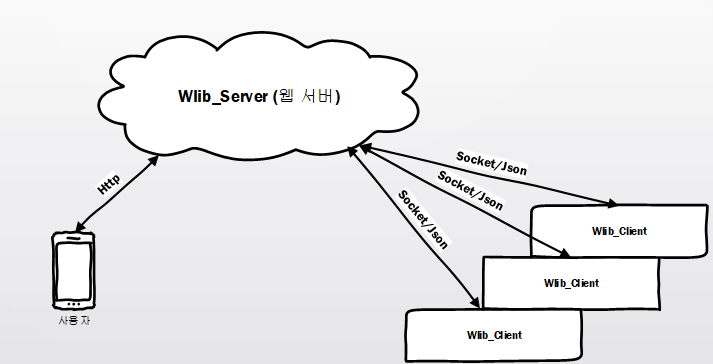

# WLib-Client

## 멤버
20185138 신영수

## 소개
리눅스의 시스템 정보를 온라인으로 볼 수 있는 프로젝트 입니다.<br>
- cpu 상태와 정보
- ram 상태와 정보
- 프로세스 상태
- 프로세스 제어

<br>

## 동작
wlin_client 는 입력한 wlin_server와 통신 합니다.<br>
사용자는 wlin_server를 통헤 연결된 시스템의 정보를 조회합니다.<br>
<br>

## 결과물
```
wlin_client
setting.json
```
<br>
실행파일 wlin_client(x) 와 설정파일 setting.json이 있습니다.

## 사용법
setting.json에 연결할 서버의 ip와 포트, 서버에 표시될 이름을 입력하고<br>
wlin_client를 실행하면 됩니다.<br>
주기적으로 서버와 통신하며, 시스템의 정보를 전송합니다.

<br>
## 작동 사진
<br>
(Test Log)

<br>
wlin_server에 접속했을때

<br>
프로세스

<br>
cpu

<br>
memory

## 빌드
cmake를 사용하여 빌드합니다.
```
$ cmake CMakeLists.txt
$ make
```
## 요구
- boost
- lib-8 이상
- <standard c++ 17>을 지원하는 컴파일러
  * gcc-8 이상
  * clang-8 이상 (사용중)
  * ...
- cmake 3.10.2 이상
